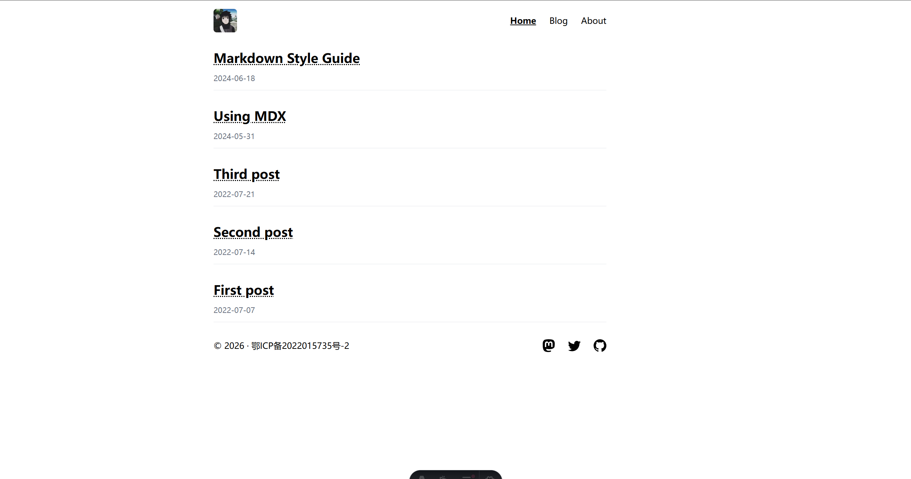

# Wing Blog (Astro)

轻量博客，基于 Astro + Tailwind CSS 4，文章路由使用发布日期：`/{yyyymmdd}.html`，自带评论开关与多种分享/过渡效果。



## ✨ 特性
- 日期路由：按发布日期生成 `yyyymmdd.html`，无需 `/blog/` 前缀。
- 评论可选：`PostLayout` 支持 `enableComments`，内置 Artalk（默认）与 Giscus 组件。
- 视图过渡：共享元素动画（标题/卡片/日期），Tailwind 4 动画变量。
- 内容：Markdown/MDX，RSS & Sitemap 已开启。
- 样式：Tailwind CSS 4 + Typography，暗色模式支持。
- 阅读时长：基于 `reading-time` 预估，显示在文章日期旁。

## 🚀 使用
```bash
npm install
npm run dev      # http://localhost:4321
npm run build
npm run preview
```

## 🗂 主要结构
```text
src/
	components/   # Header, PostsLists, Comment 组件等
	layouts/      # BaseLayout, PostLayout
	pages/        # index, about, [slug].astro (日期 .html 路由)
	content/      # blog 文章 (md/mdx)
	utils/        # 日期格式化等工具
public/         # 静态资源
```

## 📝 路由与链接
- 列表链接：`/{yyyymmdd}.html`
- 动态页：`src/pages/[slug].astro` 使用 `formatDateKey(pubDate)` 生成静态路径
- RSS：输出与页面一致的日期后缀链接

## 🔧 配置要点
- `astro.config.mjs`：`trailingSlash: "never"`，输出文件名而非目录
- 评论：在使用 `PostLayout` 时传入 `enableComments={false}` 可关闭
- 主题：Header 头像按钮切换深浅色，持久化到 localStorage

## 📌 备注
- 如需保留旧 `/blog/slug` 路径，可在 `src/pages/blog/[...slug].astro` 做重定向或保留并行路由。
- 友链页若需要，新增 `src/pages/links.astro` 并在 Header 添加入口。
