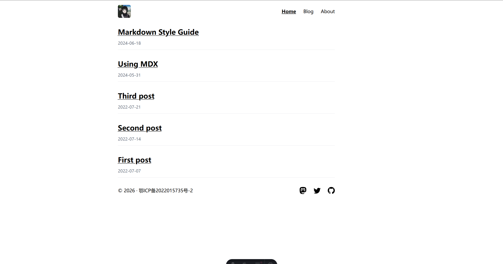

# 伍比贰 (5b2) Blog

基于 Astro + Tailwind CSS 4 构建的极简个人博客，采用日期路由格式，支持暗色模式与图片灯箱效果。



## ✨ 主要特性

- **日期路由**：文章按发布日期生成 `/{yyyymmdd}.html`，简洁直观
- **毛玻璃 UI**：Header 和文章列表采用毛玻璃质感设计
- **图片灯箱**：文章内图片支持点击放大、左右切换、键盘导航
- **评论开关**：内置评论配置，可一键开启/关闭
- **暗色模式**：支持浅色/深色主题切换，自动适配系统偏好
- **性能优化**：View Transitions 无刷新体验，Service Worker 离线缓存
- **SEO 友好**：自动生成 RSS、Sitemap，支持 Open Graph 和 Twitter Card

## 🚀 快速开始

```bash
# 安装依赖
npm install

# 开发模式
npm run dev

# 构建
npm run build

# 预览
npm run preview
```

## 🗂 项目结构

```
src/
├── components/      # 组件
│   ├── Header.astro      # 毛玻璃导航栏
│   ├── PostsLists.astro  # 文章列表
│   ├── Footer.astro      # 页脚
│   └── comment.astro     # 评论组件
├── layouts/         # 布局
│   ├── BaseLayout.astro  # 基础布局
│   └── PostLayout.astro  # 文章页布局（含灯箱）
├── pages/           # 页面
│   ├── index.astro       # 首页
│   ├── [slug].astro      # 文章详情页
│   ├── archive.astro     # 归档页
│   ├── about.astro       # 关于页
│   └── links.astro       # 友链页
├── content/blog/    # 文章目录 (Markdown/MDX)
├── styles/          # 样式文件
└── utils/           # 工具函数
public/              # 静态资源
```

## 📝 写作指南

在 `src/content/blog/` 目录下创建 `.md` 或 `.mdx` 文件：

```markdown
---
title: 文章标题
description: 文章描述
pubDate: 2025-04-10
---

正文内容...


```

## ⚙️ 配置说明

### 评论配置

编辑 `src/config.ts`：

```typescript
export const COMMENT_CONFIG = {
  enabled: false,  // true: 启用评论, false: 禁用
  system: "none" as "artalk" | "giscus" | "none"
};
```

### 站点信息

```typescript
const SITE_TITLE = "伍比贰";
const SITE_DESCRIPTION = "记录生活的点点滴滴";
const BLOGGER_NAME = "道小理";
```

### 分页配置

```typescript
export const PAGINATION_CONFIG = {
  postsPerPage: 6  // 每页显示文章数
};
```

## 🚀 部署到 Cloudflare Pages

### 一键部署

[](https://deploy.workers.cloudflare.com/?url=https://github.com/zqlit/Wing)

### 手动部署步骤

1. **Fork 本仓库** 到你的 GitHub 账号

2. **登录 Cloudflare Dashboard**
   - 进入 [Cloudflare Pages](https://dash.cloudflare.com/pages)
   - 点击 "创建项目"

3. **连接 GitHub 仓库**
   - 选择 "连接到 Git"
   - 授权 Cloudflare 访问你的 GitHub 账号
   - 选择 `Wing` 仓库

4. **配置构建设置**

   | 设置项 | 值 |
   |--------|-----|
   | 框架预设 | `Astro` |
   | 构建命令 | `npm run build` |
   | 构建输出目录 | `dist` |

5. **添加环境变量**（可选）
   
   如果需要自定义配置，在「环境变量」中添加：
   ```
   NODE_VERSION = 20
   ```

6. **点击「保存并部署」**

   Cloudflare Pages 会自动构建并部署你的网站。

### 自动部署

每次推送到 `main` 分支，Cloudflare Pages 会自动重新构建和部署。

### 自定义域名

1. 在 Cloudflare Pages 项目设置中，点击「自定义域」
2. 输入你的域名（如 `blog.example.com`）
3. 按照提示添加 DNS 记录
4. 等待 SSL 证书自动颁发

## 🎨 技术栈

- [Astro](https://astro.build/) - 静态站点生成器
- [Tailwind CSS 4](https://tailwindcss.com/) - 原子化 CSS
- [TypeScript](https://www.typescriptlang.org/) - 类型安全
- [MDX](https://mdxjs.com/) - Markdown 组件

## 📄 许可证

MIT License © 2025 道小理
